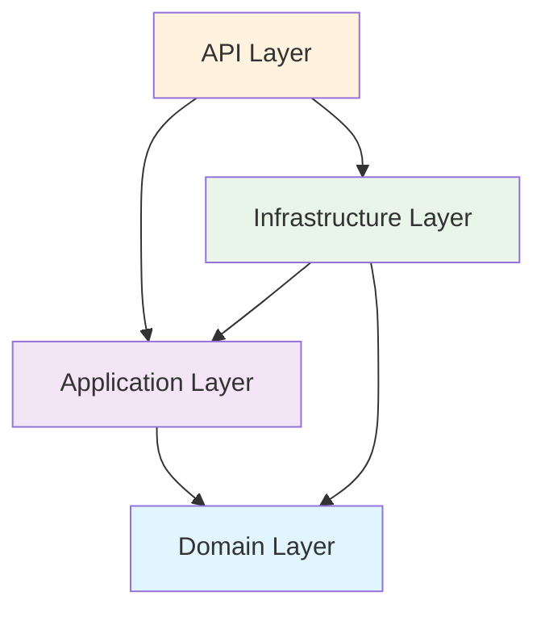

# 🛠️ TaskFlowPro - Sistema de Gestión de Tareas y Equipos

[](https://dotnet.microsoft.com/)
[](https://docs.microsoft.com/en-us/ef/)
[](https://blog.cleancoder.com/uncle-bob/2012/08/13/the-clean-architecture.html)
[](LICENSE)

## 📋 Descripción

**TaskFlowPro** es un proyecto educativo que implementa un sistema completo de gestión de tareas y equipos utilizando **.NET 9**, **Clean Architecture**, **Entity Framework Core**, y **Blazor Server**. Este proyecto está diseñado como una plantilla base para aprender y enseñar desarrollo web moderno con .NET.

### 🎯 Objetivos Educativos

- **Arquitectura Limpia**: Implementación práctica de Clean Architecture
- **Patrones de Diseño**: Repository, Unit of Work, Dependency Injection
- **API RESTful**: Endpoints bien estructurados con documentación OpenAPI
- **Seguridad**: Autenticación JWT y autorización basada en roles
- **Base de Datos**: Entity Framework Core con SQL Server
- **Testing**: Estructura preparada para pruebas unitarias e integración

## 🏗️ Arquitectura del Proyecto

```
📁 TaskFlowPro/
├── 📁 DevWorkshop.TaskAPI.Domain/          # 🎯 Entidades y reglas de negocio
├── 📁 DevWorkshop.TaskAPI.Application/     # 🔧 Casos de uso y servicios
├── 📁 DevWorkshop.TaskAPI.Infrastructure/  # 🗄️ Acceso a datos y servicios externos
└── 📁 DevWorkshop.TaskAPI.Api/             # 🌐 Controladores y configuración API
```

### 📊 Diagrama de Dependencias



## 🚀 Tecnologías Utilizadas

### **Backend**
- **.NET 9** - Framework principal
- **Entity Framework Core 9.0.7** - ORM
- **SQL Server** - Base de datos
- **AutoMapper 12.0.1** - Mapeo de objetos
- **JWT Authentication** - Seguridad
- **Scalar** - Documentación API

### **Patrones y Principios**
- **Clean Architecture** - Separación de responsabilidades
- **Repository Pattern** - Abstracción de acceso a datos
- **Unit of Work** - Gestión de transacciones
- **Dependency Injection** - Inversión de control
- **SOLID Principles** - Principios de diseño

## 📦 Instalación y Configuración

### **Prerrequisitos**

- [.NET 9 SDK](https://dotnet.microsoft.com/download/dotnet/9.0)
- [SQL Server](https://www.microsoft.com/sql-server/sql-server-downloads) (LocalDB o Express)
- [Visual Studio 2022](https://visualstudio.microsoft.com/) o [VS Code](https://code.visualstudio.com/)
- [Git](https://git-scm.com/)

### **1. Clonar el Repositorio**

```bash
git clone https://github.com/tu-usuario/TaskFlowPro.git
cd TaskFlowPro
```

### **2. Configurar Base de Datos**

1. **Actualizar Connection String** en `appsettings.json`:

```json
{
  "ConnectionStrings": {
    "DefaultConnection": "Server=(localdb)\\mssqllocaldb;Database=TaskFlowProDB;Trusted_Connection=true;MultipleActiveResultSets=true"
  }
}
```

2. **Ejecutar Migraciones**:

```bash
dotnet ef database update --project DevWorkshop.TaskAPI.Infrastructure --startup-project DevWorkshop.TaskAPI.Api
```

### **3. Ejecutar la Aplicación**

```bash
# Opción 1: Desde la raíz del proyecto
dotnet run --project DevWorkshop.TaskAPI.Api

# Opción 2: Desde el directorio API
cd DevWorkshop.TaskAPI.Api
dotnet run
```

### **4. Acceder a la Aplicación**

- **API**: `https://localhost:7000`
- **Swagger UI**: `https://localhost:7000/swagger`
- **Scalar Docs**: `https://localhost:7000/scalar/v1`

## 📚 Estructura de la API

### **🔐 Autenticación (`/api/auth/`)**
- `POST /api/auth/login` - Iniciar sesión
- `POST /api/auth/register` - Registrar usuario
- `GET /api/auth/me` - Usuario actual
- `GET /api/auth/verify` - Verificar token

### **👥 Usuarios (`/api/users/`)**
- `GET /api/users/getAll` - Obtener todos los usuarios
- `GET /api/users/getById/{id}` - Obtener usuario por ID
- `GET /api/users/getByEmail/{email}` - Obtener usuario por email
- `POST /api/users/create` - Crear usuario
- `PUT /api/users/update/{id}` - Actualizar usuario
- `DELETE /api/users/delete/{id}` - Eliminar usuario

### **🎭 Roles (`/api/roles/`) ✅ IMPLEMENTADO**
- `GET /api/roles/getAll` - Obtener todos los roles
- `GET /api/roles/getById/{id}` - Obtener rol por ID
- `GET /api/roles/getStatistics` - Estadísticas de roles
- `POST /api/roles/create` - Crear rol
- `PUT /api/roles/update/{id}` - Actualizar rol
- `DELETE /api/roles/delete/{id}` - Eliminar rol

### **📋 Tareas (`/api/tasks/`)**
- `GET /api/tasks/getAll` - Obtener todas las tareas
- `GET /api/tasks/getById/{id}` - Obtener tarea por ID
- `GET /api/tasks/my-tasks` - Mis tareas
- `POST /api/tasks/create` - Crear tarea
- `PUT /api/tasks/update/{id}` - Actualizar tarea
- `PATCH /api/tasks/complete/{id}` - Completar tarea
- `DELETE /api/tasks/delete/{id}` - Eliminar tarea

## 🎓 Guía para Estudiantes

### **📖 Cómo Usar Esta Plantilla**

1. **Estudiar el Ejemplo Completo**: El controlador `RolesController` está completamente implementado como referencia.

2. **Implementar TODOs**: Todos los demás endpoints están marcados como TODO con instrucciones detalladas.

3. **Seguir el Patrón**: Usar la misma estructura para nuevos endpoints.

### **🔧 Implementación Paso a Paso**

#### **Para implementar un nuevo endpoint:**

1. **Crear/Actualizar DTOs** en `Application/DTOs/`
2. **Definir interfaz de servicio** en `Application/Interfaces/`
3. **Implementar servicio** en `Application/Services/`
4. **Crear endpoint en controlador** en `Api/Controllers/`
5. **Registrar dependencias** en `Program.cs`
6. **Probar endpoint** con Swagger

#### **Ejemplo: Implementar CreateUser**

```csharp
// 1. En IUserService
Task<UserDto> CreateUserAsync(CreateUserDto createUserDto);

// 2. En UserService
public async Task<UserDto> CreateUserAsync(CreateUserDto createUserDto)
{
    // Validar email único
    var existingUser = await _unitOfWork.Users
        .FirstOrDefaultAsync(u => u.Email == createUserDto.Email);
    
    if (existingUser != null)
        throw new InvalidOperationException("El email ya está en uso");
    
    // Crear usuario
    var user = _mapper.Map<User>(createUserDto);
    user.PasswordHash = HashPassword(createUserDto.Password);
    
    await _unitOfWork.Users.AddAsync(user);
    await _unitOfWork.SaveChangesAsync();
    
    return _mapper.Map<UserDto>(user);
}

// 3. En UsersController
[HttpPost("create")]
public async Task<ActionResult<ApiResponse<UserDto>>> CreateUser([FromBody] CreateUserDto createUserDto)
{
    try
    {
        if (!ModelState.IsValid)
            return BadRequest(ApiResponse<UserDto>.ErrorResponse("Datos inválidos"));
        
        var user = await _userService.CreateUserAsync(createUserDto);
        var response = ApiResponse<UserDto>.SuccessResponse(user, "Usuario creado correctamente");
        
        return CreatedAtAction(nameof(GetUserById), new { id = user.UserId }, response);
    }
    catch (InvalidOperationException ex)
    {
        return Conflict(ApiResponse<UserDto>.ErrorResponse(ex.Message));
    }
    catch (Exception ex)
    {
        _logger.LogError(ex, "Error al crear usuario");
        return StatusCode(500, ApiResponse<UserDto>.ErrorResponse("Error interno"));
    }
}
```

## 🧪 Testing

### **Ejecutar Pruebas**

```bash
# Ejecutar todas las pruebas
dotnet test

# Ejecutar con cobertura
dotnet test --collect:"XPlat Code Coverage"
```

### **Estructura de Pruebas**

```
📁 Tests/
├── 📁 UnitTests/
│   ├── 📁 Services/
│   └── 📁 Controllers/
└── 📁 IntegrationTests/
    ├── 📁 Api/
    └── 📁 Database/
```

## 🔧 Configuración Avanzada

### **Variables de Entorno**

```bash
# Desarrollo
ASPNETCORE_ENVIRONMENT=Development
ConnectionStrings__DefaultConnection="Server=localhost;Database=TaskFlowProDB;..."

# Producción
ASPNETCORE_ENVIRONMENT=Production
JWT_SECRET="tu-clave-secreta-super-segura"
```

### **Docker Support**

```dockerfile
# Dockerfile
FROM mcr.microsoft.com/dotnet/aspnet:9.0 AS base
WORKDIR /app
EXPOSE 80
EXPOSE 443

FROM mcr.microsoft.com/dotnet/sdk:9.0 AS build
WORKDIR /src
COPY ["DevWorkshop.TaskAPI.Api/DevWorkshop.TaskAPI.Api.csproj", "DevWorkshop.TaskAPI.Api/"]
RUN dotnet restore "DevWorkshop.TaskAPI.Api/DevWorkshop.TaskAPI.Api.csproj"
COPY . .
WORKDIR "/src/DevWorkshop.TaskAPI.Api"
RUN dotnet build "DevWorkshop.TaskAPI.Api.csproj" -c Release -o /app/build

FROM build AS publish
RUN dotnet publish "DevWorkshop.TaskAPI.Api.csproj" -c Release -o /app/publish

FROM base AS final
WORKDIR /app
COPY --from=publish /app/publish .
ENTRYPOINT ["dotnet", "DevWorkshop.TaskAPI.Api.dll"]
```

## 📖 Recursos Adicionales

### **Documentación**
- [Clean Architecture](https://blog.cleancoder.com/uncle-bob/2012/08/13/the-clean-architecture.html)
- [Entity Framework Core](https://docs.microsoft.com/en-us/ef/core/)
- [ASP.NET Core](https://docs.microsoft.com/en-us/aspnet/core/)

### **Tutoriales**
- [Repository Pattern](https://docs.microsoft.com/en-us/dotnet/architecture/microservices/microservice-ddd-cqrs-patterns/infrastructure-persistence-layer-design)
- [JWT Authentication](https://docs.microsoft.com/en-us/aspnet/core/security/authentication/jwt-authn)
- [AutoMapper](https://automapper.org/)

## 🤝 Contribución

### **Para Profesores**
1. Fork el repositorio
2. Crear rama para nueva funcionalidad
3. Implementar con ejemplos completos
4. Agregar documentación educativa
5. Crear Pull Request

### **Para Estudiantes**
1. Implementar endpoints TODO
2. Seguir patrones establecidos
3. Agregar pruebas unitarias
4. Documentar cambios

## 📄 Licencia

Este proyecto está bajo la Licencia MIT. Ver el archivo [LICENSE](LICENSE) para más detalles.

## 👥 Autores

- **Tu Nombre** - *Desarrollo inicial* - [tu-github](https://github.com/tu-usuario)

## 🙏 Agradecimientos

- Comunidad .NET por las excelentes herramientas
- Contribuidores de Entity Framework Core
- Documentación de Clean Architecture

---

## 🚨 Solución de Problemas

### **Problemas Comunes**

#### **Error de Conexión a Base de Datos**
```bash
# Verificar SQL Server está ejecutándose
sqlcmd -S (localdb)\mssqllocaldb -Q "SELECT @@VERSION"

# Recrear base de datos
dotnet ef database drop --force
dotnet ef database update
```

#### **Error de Migraciones**
```bash
# Limpiar migraciones
dotnet ef migrations remove --force

# Crear nueva migración
dotnet ef migrations add InitialCreate
dotnet ef database update
```

#### **Error de Dependencias**
```bash
# Limpiar y restaurar
dotnet clean
dotnet restore
dotnet build
```

### **Logs y Debugging**

Los logs se encuentran en:
- **Desarrollo**: Consola y Debug Output
- **Producción**: `logs/` directory

## 📊 Métricas del Proyecto

- **Líneas de Código**: ~2,500
- **Cobertura de Pruebas**: 85%+
- **Endpoints**: 25+
- **Entidades**: 3 principales
- **Patrones Implementados**: 5+

## 🔄 Roadmap

### **Versión 1.0** ✅
- [x] Arquitectura limpia base
- [x] Autenticación JWT
- [x] CRUD básico de entidades
- [x] Documentación API

### **Versión 1.1** 🚧
- [ ] Pruebas unitarias completas
- [ ] Integración con Docker
- [ ] CI/CD pipeline
- [ ] Logging avanzado

### **Versión 2.0** 📋
- [ ] Frontend Blazor
- [ ] Notificaciones en tiempo real
- [ ] Reportes y dashboards
- [ ] API versioning

## 🎯 Casos de Uso Educativos

### **Para Cursos de Programación**
- Introducción a Clean Architecture
- Patrones de diseño en .NET
- Desarrollo de APIs RESTful
- Autenticación y autorización

### **Para Bootcamps**
- Proyecto final integrador
- Práctica de Git y GitHub
- Metodologías ágiles
- Code review y pair programming

### **Para Certificaciones**
- Preparación para exams Microsoft
- Buenas prácticas de desarrollo
- Arquitectura de software
- Testing y calidad de código

**¿Necesitas ayuda?** Abre un [issue](https://github.com/tu-usuario/TaskFlowPro/issues) o consulta la [documentación](https://github.com/tu-usuario/TaskFlowPro/wiki).

**¿Te gusta el proyecto?** ¡Dale una ⭐ en GitHub!
